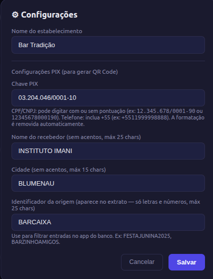

# Sistema de Bar — Funcionalidades para o Próximo Evento

## Índice

1. [Compra de Fichas](#compra-de-fichas)
2. [PDV de venda no balcão](#pdv-de-venda-no-balcão)
3. [Cadastro de Produtos](#cadastro-de-produtos)
4. [Cadastro de Almoxarifado](#cadastro-de-almoxarifado)
5. [Controle de Estoque](#controle-de-estoque)
6. [Caixa](#caixa)
7. [Lucro](#lucro)
8. [Configuração](#configuração)
9. [Questões em Aberto](#questões)

---

Para o próximo evento podemos usar o sistema de bar com as seguintes funcionalidades:

## Compra de Fichas:

Tela de venda de fichas para o cliente. O operador seleciona as denominações que o cliente quer comprar (R$ 1, R$ 2, R$ 5, R$ 10 e R$ 20). O total é calculado automaticamente e exibido com o detalhamento de cada denominação. É possível remover uma unidade de cada denominação antes de confirmar o pagamento. Ao finalizar, o sistema registra a venda e limpa o carrinho de fichas.

### Pagamento em:
* Em dinheiro
* PIX

PIX gera qr-Code com valor a ser pago e descrição do que esta sendo pago

Ao escolher PIX, um modal abre com o QR Code gerado dinamicamente no padrão EMV/BR.GOV.BCB.PIX, o valor formatado, a chave PIX e um botão para copiar o código Copia e Cola. O operador confirma o recebimento antes de liberar as fichas.

---

## PDV de venda no balcão

Grade de produtos exibida por ordem de ranking, com filtro por nome ou categoria. Cada clique no produto adiciona uma unidade ao carrinho. O painel lateral mostra os itens do pedido com controles de quantidade (+/−) e o total da venda. Ao confirmar, o sistema deduz o estoque do almoxarifado de venda definido para cada produto e registra a venda com data/hora.

---

## Cadastro de Produtos

Tela de listagem e cadastro de produtos. Exibe todos os produtos com nome, categoria, preço de venda, custo, estoque atual e almoxarifado de venda. Possui filtro por nome e filtro multi-seleção por categoria. As ações disponíveis são:

- **Novo Produto** — formulário com nome, preço de venda, custo unitário, categoria, SKU, ordem de exibição (rank) e almoxarifado de venda padrão (de qual estoque o PDV debita)
- **Editar** — altera qualquer campo do produto
- **Excluir** — remove o produto e seu estoque
- **Importar CSV** — importa produtos em massa a partir de um arquivo CSV com separador `;`
- **Categorias** — gerencia as categorias disponíveis (nome, cor, ícone); exclusão reatribui produtos para "Outro"

---

## Cadastro de Almoxarifado

Gerenciamento dos locais de estoque do evento. Cada almoxarifado tem nome, tipo e ordem de exibição. Os tipos disponíveis são:

- **Consignado** — mercadoria de terceiros que precisa de acerto posterior
- **Freezer** — estoque refrigerado
- **Próprio** — estoque da organização
- **Outro** — uso genérico

A aba exibe o total de unidades e de produtos com estoque em cada local. Um almoxarifado só pode ser excluído se nenhum produto o tiver como almoxarifado de venda ativo. Há também atalho para o histórico completo de movimentações.

---

## Controle de Estoque

Visão consolidada do estoque com cards de resumo por almoxarifado (total de unidades e produtos) e tabela de estoque cruzada produto × almoxarifado. O almoxarifado de venda ativo de cada produto é marcado com asterisco (*). As colunas são ordenáveis (nome, categoria, vendido, devolvido, saldo). Filtros por nome e categoria permitem localizar produtos rapidamente. As operações disponíveis são:

- **Entrada** — registra recebimento de mercadoria em um almoxarifado com quantidade, custo unitário e data/hora
- **Transferir** — move unidades de um almoxarifado para outro
- **Devolver** — registra devolução ao fornecedor (debita o estoque)
- **Movimentações** — exibe o histórico completo de todas as movimentações (entradas, vendas, transferências, devoluções) com filtro por tipo e produto
- **Consignado** — relatório específico para acerto com fornecedores consignados: mostra o que entrou, o que foi vendido e o saldo a devolver

A tabela calcula o **Saldo** (entradas − vendas − devoluções) e indica o status de cada produto: OK, Baixo (≤ 3 unidades) ou Esgotado.

---

## Caixa

Resumo financeiro da sessão corrente. Exibe cards com:

- Total de fichas vendidas
- Valor recebido via PIX
- Valor recebido em dinheiro
- Total de vendas do PDV (em fichas)
- Quantidade de itens vendidos e de pedidos

Abaixo dos cards, lista as vendas por produto agrupadas por categoria. O botão **Fechar Caixa** encerra a sessão, gera um relatório do período, zera as vendas e o estoque vendido do dia, e acumula o lucro para o histórico. O botão **Exportar Relatório (.md)** gera um arquivo Markdown completo com fichas, vendas por categoria, estoque atual por almoxarifado, resumo consignado e custos fixos — pronto para arquivar ou compartilhar.

---

## Lucro 

Análise de rentabilidade da sessão atual. Exibe cards com:

- Receita total dos produtos
- Custo total dos produtos
- Total de custos fixos do evento
- **Lucro líquido desta sessão** (receita − custo produtos − custos fixos)
- Lucro acumulado dos fechamentos anteriores
- **Lucro total do evento** (sessão + acumulado)

A tabela de vendas é agrupada por categoria, com colunas de quantidade, percentual do volume total, custo, receita, lucro e margem (%). O rodapé mostra o subtotal de produtos, o desconto dos custos fixos e o lucro líquido final.

**Custos fixos do evento** — cadastro de itens como aluguel de equipamentos, gás, gelo, etc. Cada item tem descrição, quantidade e custo unitário. O total é descontado automaticamente do lucro.

---

## Configuração

Painel de configurações gerais do sistema, acessível pelo ícone ⚙ no cabeçalho. Permite definir:

- **Nome do estabelecimento** — exibido no cabeçalho do sistema e nos relatórios exportados
- **Chave PIX** — chave usada para gerar o QR Code de pagamento (aceita CPF, CNPJ, e-mail, telefone ou chave aleatória)
- **Nome do recebedor PIX** — nome que aparece no QR Code
- **Cidade** — cidade do estabelecimento, campo obrigatório pelo padrão EMV PIX
- **Descrição PIX** — identificador da transação no extrato do pagador

## Questões:

No PDV também poderia receber via PIX diretamente com QrCode, assim teriamos 100% do consumo registrado com venda por Nasrudins ou PIX direto.
