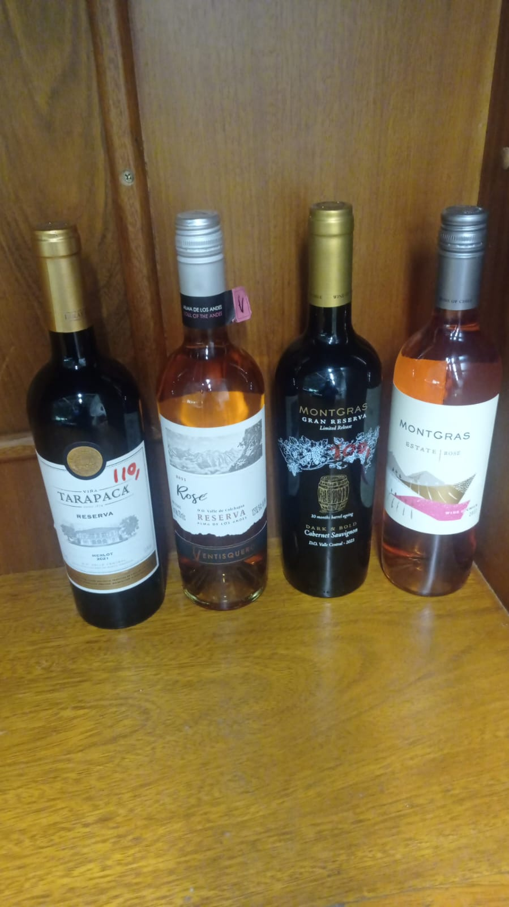
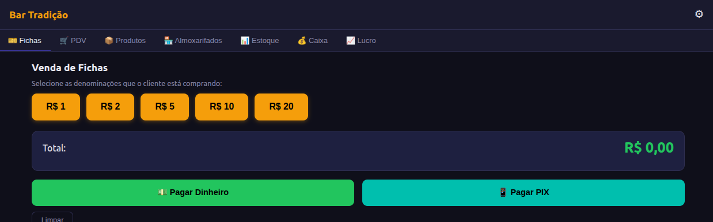
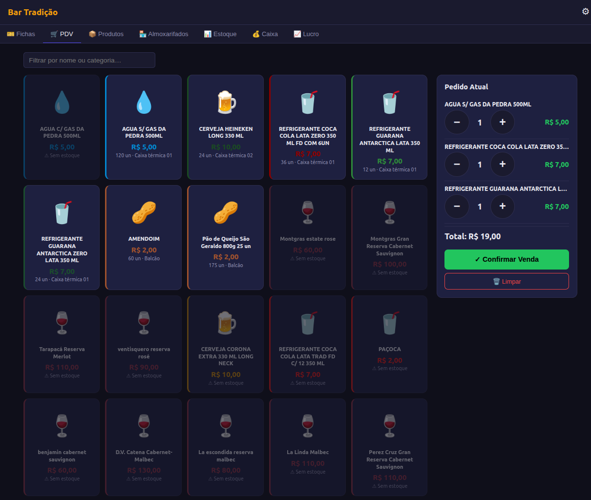
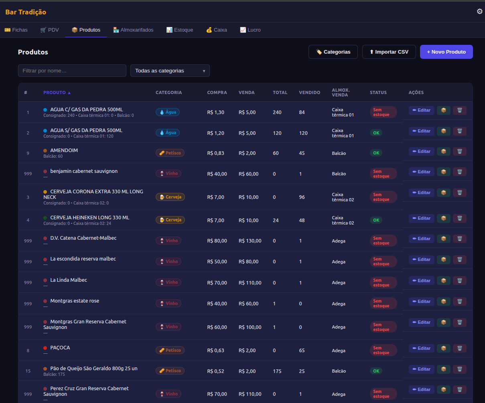
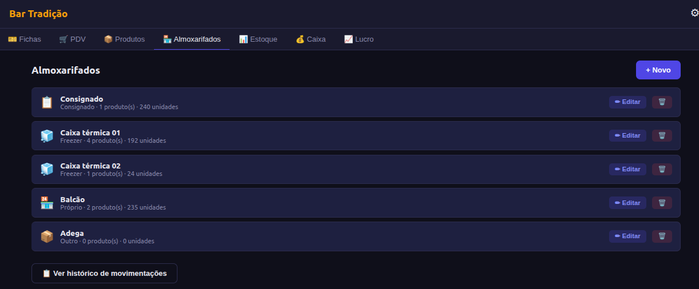
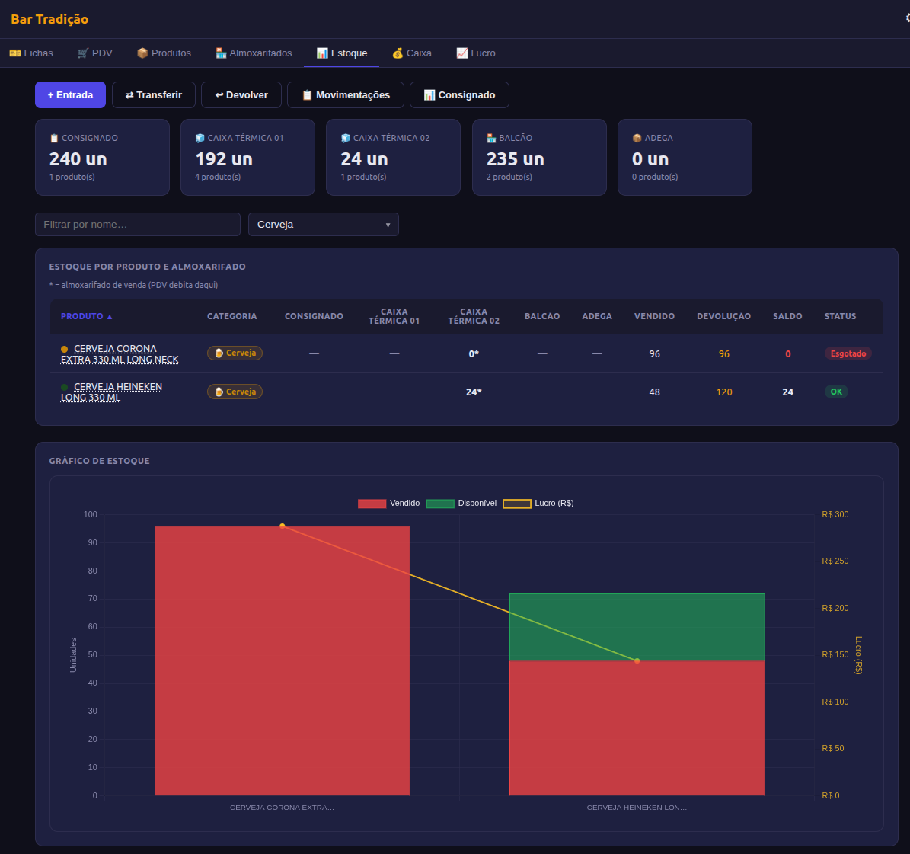
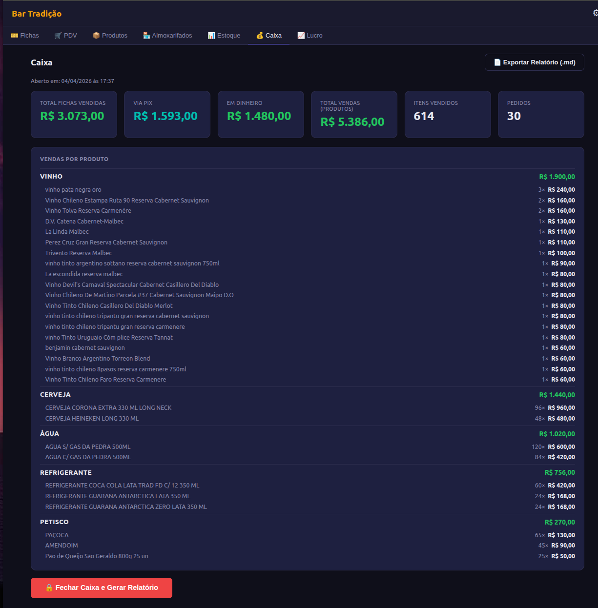
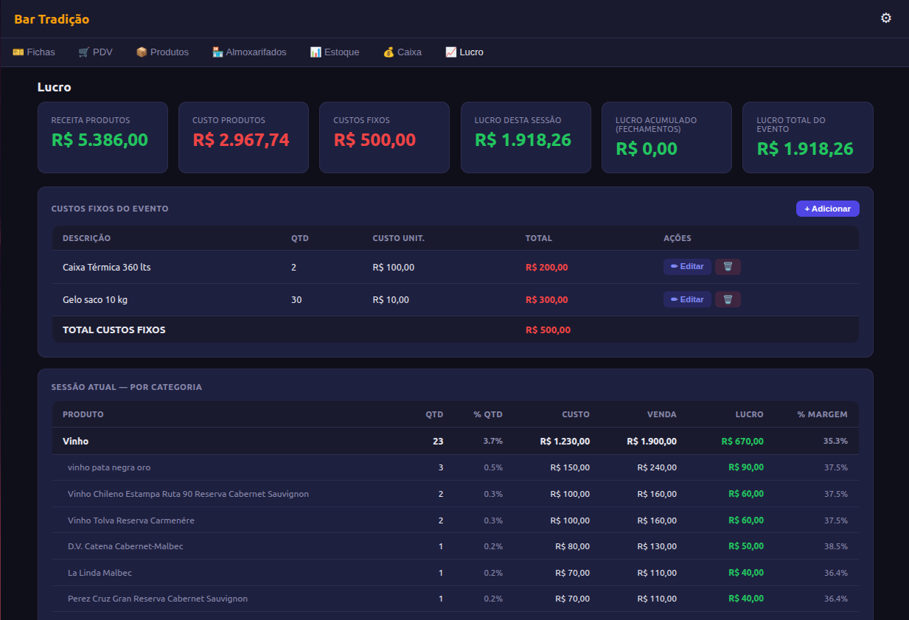

# Relatório de Evento — Bar Tradição

**Data:** 09/04/2026
**Período:** 04/04/2026 17:37 → 09/04/2026 22:37
**Gerado em:** 09/04/2026, 22:37:25

---

## 1. Resumo Financeiro

| | Valor |
|---|---:|
| Fichas vendidas — PIX | R$ 1593,00 |
| Fichas vendidas — Dinheiro | R$ 1480,00 |
| **Total fichas** | **R$ 3073,00** |
| Receita produtos | R$ 5386,00 |
| Custo produtos | R$ 2967,74 |
| Custos fixos | R$ 0,00 |
| **Lucro sessão atual** | **R$ 2418,26** |
| Lucro acumulado (fechamentos anteriores) | R$ 0,00 |
| **Lucro total do evento** | **R$ 2418,26** |
| Margem geral | 44.9% |
| Pedidos | 30 |
| Itens vendidos | 614 |

Observação: A Receita tive que fazer pela saida de estoque pelos seguintes fatos:

* Não tive controle do que foi pago em PIX, somente o dinheiro
* No inicio não tinha as cedulas de Nasrudins
* Muitas pessoas pagaram itens sem querer Nasrudins
* Zé Aldo fez um caderninho de fiado e pagou com PIX no final
---

## 2. Custos Fixos do Evento

| Descrição | Qtd | Custo Unit. | Total |
|-----------|----:|------------:|------:|
| _Nenhum custo fixo cadastrado_ | | | |

---

## 3. Vendas por Categoria e Produto

### Vinho

| Produto | Qtd | Receita | Custo | Lucro | Margem |
|---------|----:|--------:|------:|------:|-------:|
| vinho pata negra oro | 3 | R$ 240,00 | R$ 150,00 | R$ 90,00 | 37.5% |
| Vinho Chileno Estampa Ruta 90 Reserva Cabernet Sauvignon | 2 | R$ 160,00 | R$ 100,00 | R$ 60,00 | 37.5% |
| Vinho Tolva Reserva Carmenére | 2 | R$ 160,00 | R$ 100,00 | R$ 60,00 | 37.5% |
| D.V. Catena Cabernet-Malbec | 1 | R$ 130,00 | R$ 80,00 | R$ 50,00 | 38.5% |
| La Linda Malbec | 1 | R$ 110,00 | R$ 70,00 | R$ 40,00 | 36.4% |
| Perez Cruz Gran Reserva Cabernet Sauvignon | 1 | R$ 110,00 | R$ 70,00 | R$ 40,00 | 36.4% |
| Trivento Reserva Malbec | 1 | R$ 100,00 | R$ 60,00 | R$ 40,00 | 40.0% |
| vinho tinto argentino sottano reserva cabernet sauvignon 750ml | 1 | R$ 90,00 | R$ 60,00 | R$ 30,00 | 33.3% |
| La escondida reserva malbec | 1 | R$ 80,00 | R$ 50,00 | R$ 30,00 | 37.5% |
| Vinho Devil's Carnaval Spectacular Cabernet Casillero Del Diablo | 1 | R$ 80,00 | R$ 50,00 | R$ 30,00 | 37.5% |
| Vinho Chileno De Martino Parcela #37 Cabernet Sauvignon Maipo D.O | 1 | R$ 80,00 | R$ 50,00 | R$ 30,00 | 37.5% |
| Vinho Tinto Chileno Casillero Del Diablo Merlot | 1 | R$ 80,00 | R$ 50,00 | R$ 30,00 | 37.5% |
| vinho tinto chileno tripantu gran reserva cabernet sauvignon | 1 | R$ 80,00 | R$ 50,00 | R$ 30,00 | 37.5% |
| vinho tinto chileno tripantu gran reserva carmenere | 1 | R$ 80,00 | R$ 80,00 | R$ 0,00 | 0.0% |
| vinho Tinto Uruguaio Cóm plice Reserva Tannat | 1 | R$ 80,00 | R$ 50,00 | R$ 30,00 | 37.5% |
| benjamin cabernet sauvignon | 1 | R$ 60,00 | R$ 40,00 | R$ 20,00 | 33.3% |
| Vinho Branco Argentino Torreon Blend | 1 | R$ 60,00 | R$ 40,00 | R$ 20,00 | 33.3% |
| vinho tinto chileno 8pasos reserva carmenere 750ml | 1 | R$ 60,00 | R$ 40,00 | R$ 20,00 | 33.3% |
| Vinho Tinto Chileno Faro Reserva Carmenere | 1 | R$ 60,00 | R$ 40,00 | R$ 20,00 | 33.3% |
| **Total Vinho** | | **R$ 1900,00** | **R$ 1230,00** | **R$ 670,00** | **35.3%** |

### Cerveja

| Produto | Qtd | Receita | Custo | Lucro | Margem |
|---------|----:|--------:|------:|------:|-------:|
| CERVEJA CORONA EXTRA 330 ML LONG NECK | 96 | R$ 960,00 | R$ 672,00 | R$ 288,00 | 30.0% |
| CERVEJA HEINEKEN LONG 330 ML | 48 | R$ 480,00 | R$ 336,00 | R$ 144,00 | 30.0% |
| **Total Cerveja** | | **R$ 1440,00** | **R$ 1008,00** | **R$ 432,00** | **30.0%** |

### Água

| Produto | Qtd | Receita | Custo | Lucro | Margem |
|---------|----:|--------:|------:|------:|-------:|
| AGUA S/ GAS DA PEDRA 500ML | 120 | R$ 600,00 | R$ 144,00 | R$ 456,00 | 76.0% |
| AGUA C/ GAS DA PEDRA 500ML | 84 | R$ 420,00 | R$ 109,20 | R$ 310,80 | 74.0% |
| **Total Água** | | **R$ 1020,00** | **R$ 253,20** | **R$ 766,80** | **75.2%** |

### Refrigerante

| Produto | Qtd | Receita | Custo | Lucro | Margem |
|---------|----:|--------:|------:|------:|-------:|
| REFRIGERANTE COCA COLA LATA TRAD FD C/ 12 350 ML | 60 | R$ 420,00 | R$ 222,00 | R$ 198,00 | 47.1% |
| REFRIGERANTE GUARANA ANTARCTICA LATA 350 ML | 24 | R$ 168,00 | R$ 81,60 | R$ 86,40 | 51.4% |
| REFRIGERANTE GUARANA ANTARCTICA ZERO LATA 350 ML | 24 | R$ 168,00 | R$ 81,60 | R$ 86,40 | 51.4% |
| **Total Refrigerante** | | **R$ 756,00** | **R$ 385,20** | **R$ 370,80** | **49.0%** |

### Petisco

| Produto | Qtd | Receita | Custo | Lucro | Margem |
|---------|----:|--------:|------:|------:|-------:|
| PAÇOCA | 65 | R$ 130,00 | R$ 40,95 | R$ 89,05 | 68.5% |
| AMENDOIM | 45 | R$ 90,00 | R$ 37,39 | R$ 52,61 | 58.5% |
| Pão de Queijo São Geraldo 800g 25 un | 25 | R$ 50,00 | R$ 13,00 | R$ 37,00 | 74.0% |
| **Total Petisco** | | **R$ 270,00** | **R$ 91,34** | **R$ 178,66** | **66.2%** |

---

## 4. Posição de Estoque

> ⚠️ **Divergências detectadas** (marcadas com ⚠️ na tabela — a soma dos almoxarifados não bate com o total do produto, provavelmente por venda registrada no almoxarifado errado):
>
> - **Montgras estate rose**: soma dos almoxarifados = 0, total registrado = 1 (divergência — use Ajuste para corrigir)
> - **Montgras Gran Reserva Cabernet Sauvignon**: soma dos almoxarifados = 0, total registrado = 1 (divergência — use Ajuste para corrigir)
> - **Tarapacá Reserva Merlot**: soma dos almoxarifados = 0, total registrado = 1 (divergência — use Ajuste para corrigir)
> - **ventisquero reserva rosé**: soma dos almoxarifados = 0, total registrado = 1 (divergência — use Ajuste para corrigir)

| Produto | Categoria | Consignado | Caixa térmica 01 | Caixa térmica 02 | Balcão | Adega | Total | Vendido | Status |
|---------|-----------|----:|----:|----:|----:|----:|------:|--------:|--------|
| AGUA C/ GAS DA PEDRA 500ML | Água | 240 | 0 | 0 | 0 | 0 | 240 | 84 | ✅ OK |
| AGUA S/ GAS DA PEDRA 500ML | Água | 0 | 120 | 0 | 0 | 0 | 120 | 120 | ✅ OK |
| CERVEJA CORONA EXTRA 330 ML LONG NECK | Cerveja | 0 | 0 | 0 | 0 | 0 | 0 | 96 | ⚠ Esgotado |
| CERVEJA HEINEKEN LONG 330 ML | Cerveja | 0 | 0 | 24 | 0 | 0 | 24 | 48 | ✅ OK |
| AMENDOIM | Petisco | 0 | 0 | 0 | 60 | 0 | 60 | 45 | ✅ OK |
| PAÇOCA | Petisco | 0 | 0 | 0 | 0 | 0 | 0 | 65 | ⚠ Esgotado |
| Pão de Queijo São Geraldo 800g 25 un | Petisco | 0 | 0 | 0 | 175 | 0 | 175 | 25 | ✅ OK |
| REFRIGERANTE COCA COLA LATA TRAD FD C/ 12 350 ML | Refrigerante | 0 | 0 | 0 | 0 | 0 | 0 | 60 | ⚠ Esgotado |
| REFRIGERANTE COCA COLA LATA ZERO 350 ML FD COM 6UN | Refrigerante | 0 | 36 | 0 | 0 | 0 | 36 | 0 | ✅ OK |
| REFRIGERANTE GUARANA ANTARCTICA LATA 350 ML | Refrigerante | 0 | 12 | 0 | 0 | 0 | 12 | 24 | ✅ OK |
| REFRIGERANTE GUARANA ANTARCTICA ZERO LATA 350 ML | Refrigerante | 0 | 24 | 0 | 0 | 0 | 24 | 24 | ✅ OK |
| benjamin cabernet sauvignon | Vinho | 0 | 0 | 0 | 0 | 0 | 0 | 1 | ⚠ Esgotado |
| D.V. Catena Cabernet-Malbec | Vinho | 0 | 0 | 0 | 0 | 0 | 0 | 1 | ⚠ Esgotado |
| La escondida reserva malbec | Vinho | 0 | 0 | 0 | 0 | 0 | 0 | 1 | ⚠ Esgotado |
| La Linda Malbec | Vinho | 0 | 0 | 0 | 0 | 0 | 0 | 1 | ⚠ Esgotado |
| Montgras estate rose ⚠️ | Vinho | 0 | 0 | 0 | 0 | 0 | 1 | 0 | 🔶 Baixo |
| Montgras Gran Reserva Cabernet Sauvignon ⚠️ | Vinho | 0 | 0 | 0 | 0 | 0 | 1 | 0 | 🔶 Baixo |
| Perez Cruz Gran Reserva Cabernet Sauvignon | Vinho | 0 | 0 | 0 | 0 | 0 | 0 | 1 | ⚠ Esgotado |
| Tarapacá Reserva Merlot ⚠️ | Vinho | 0 | 0 | 0 | 0 | 0 | 1 | 0 | 🔶 Baixo |
| Trivento Reserva Malbec | Vinho | 0 | 0 | 0 | 0 | 0 | 0 | 1 | ⚠ Esgotado |
| ventisquero reserva rosé ⚠️ | Vinho | 0 | 0 | 0 | 0 | 0 | 1 | 0 | 🔶 Baixo |
| Vinho Branco Argentino Torreon Blend | Vinho | 0 | 0 | 0 | 0 | 0 | 0 | 1 | ⚠ Esgotado |
| Vinho Chileno De Martino Parcela #37 Cabernet Sauvignon Maipo D.O | Vinho | 0 | 0 | 0 | 0 | 0 | 0 | 1 | ⚠ Esgotado |
| Vinho Chileno Estampa Ruta 90 Reserva Cabernet Sauvignon | Vinho | 0 | 0 | 0 | 0 | 0 | 0 | 2 | ⚠ Esgotado |
| Vinho Devil's Carnaval Spectacular Cabernet Casillero Del Diablo | Vinho | 0 | 0 | 0 | 0 | 0 | 0 | 1 | ⚠ Esgotado |
| vinho pata negra oro | Vinho | 0 | 0 | 0 | 0 | 0 | 0 | 3 | ⚠ Esgotado |
| vinho tinto argentino sottano reserva cabernet sauvignon 750ml | Vinho | 0 | 0 | 0 | 0 | 0 | 0 | 1 | ⚠ Esgotado |
| vinho tinto chileno 8pasos reserva carmenere 750ml | Vinho | 0 | 0 | 0 | 0 | 0 | 0 | 1 | ⚠ Esgotado |
| Vinho Tinto Chileno Casillero Del Diablo Merlot | Vinho | 0 | 0 | 0 | 0 | 0 | 0 | 1 | ⚠ Esgotado |
| Vinho Tinto Chileno Faro Reserva Carmenere | Vinho | 0 | 0 | 0 | 0 | 0 | 0 | 1 | ⚠ Esgotado |
| vinho tinto chileno tripantu gran reserva cabernet sauvignon | Vinho | 0 | 0 | 0 | 0 | 0 | 0 | 1 | ⚠ Esgotado |
| vinho tinto chileno tripantu gran reserva carmenere | Vinho | 0 | 0 | 0 | 0 | 0 | 0 | 1 | ⚠ Esgotado |
| vinho Tinto Uruguaio Cóm plice Reserva Tannat | Vinho | 0 | 0 | 0 | 0 | 0 | 0 | 1 | ⚠ Esgotado |
| Vinho Tolva Reserva Carmenére | Vinho | 0 | 0 | 0 | 0 | 0 | 0 | 2 | ⚠ Esgotado |

Observação: Ficou no estoque 4 garrafas de vinho que precisam ser devolvidas ao Oswaldo

---

## 5. Controle Consignado

| Produto | Entrou (un) | Valor entrada | Transferido | Vendido (un) | Receita venda | Devolvido (un) | Valor devolvido | Saldo consig. | Saldo freezer |
|---------|------------:|--------------:|------------:|-------------:|--------------:|---------------:|----------------:|--------------:|--------------:|
| CERVEJA HEINEKEN LONG 330 ML | 192 | R$ 1344,00 | 72 | 48 | R$ 480,00 | 120 | R$ 840,00 | — | 24 |
| CERVEJA CORONA EXTRA 330 ML LONG NECK | 192 | R$ 1344,00 | 96 | 96 | R$ 960,00 | 96 | R$ 672,00 | — | — |
| REFRIGERANTE COCA COLA LATA TRAD FD C/ 12 350 ML | 240 | R$ 888,00 | 60 | 60 | R$ 420,00 | 180 | R$ 666,00 | — | — |
| REFRIGERANTE GUARANA ANTARCTICA LATA 350 ML | 192 | R$ 652,80 | 12 | 24 | R$ 168,00 | 84 | R$ 285,60 | — | 12 |
| REFRIGERANTE COCA COLA LATA ZERO 350 ML FD COM 6UN | 120 | R$ 444,00 | 36 | — | — | 84 | R$ 310,80 | — | 36 |
| AGUA C/ GAS DA PEDRA 500ML | 336 | R$ 412,80 | 84 | 84 | R$ 420,00 | 12 | R$ 15,60 | 240 | — |
| AGUA S/ GAS DA PEDRA 500ML | 240 | R$ 288,00 | 120 | 120 | R$ 600,00 | 120 | R$ 144,00 | — | 120 |
| REFRIGERANTE GUARANA ANTARCTICA ZERO LATA 350 ML | 48 | R$ 163,20 | 24 | 24 | R$ 168,00 | 24 | R$ 81,60 | — | 24 |
| **TOTAL** | | **R$ 5536,80** | | | **R$ 3216,00** | | **R$ 3015,60** | | |

> **Leitura:** Entrada = Transferido para freezers + Devolvido ao fornecedor + Saldo consig.
> Ambas as saídas (Venda e Devolução) reduzem a obrigação com o fornecedor.

---

## 6. Catálogo de Preços

| Produto | Categoria | Custo | Preço de Venda | Margem |
|---------|-----------|------:|---------------:|-------:|
| AGUA C/ GAS DA PEDRA 500ML | Água | R$ 1,30 | R$ 5,00 | 74.0% |
| AGUA S/ GAS DA PEDRA 500ML | Água | R$ 1,20 | R$ 5,00 | 76.0% |
| CERVEJA CORONA EXTRA 330 ML LONG NECK | Cerveja | R$ 7,00 | R$ 10,00 | 30.0% |
| CERVEJA HEINEKEN LONG 330 ML | Cerveja | R$ 7,00 | R$ 10,00 | 30.0% |
| AMENDOIM | Petisco | R$ 0,83 | R$ 2,00 | 58.5% |
| PAÇOCA | Petisco | R$ 0,63 | R$ 2,00 | 68.5% |
| Pão de Queijo São Geraldo 800g 25 un | Petisco | R$ 0,52 | R$ 2,00 | 74.0% |
| REFRIGERANTE COCA COLA LATA TRAD FD C/ 12 350 ML | Refrigerante | R$ 3,70 | R$ 7,00 | 47.1% |
| REFRIGERANTE COCA COLA LATA ZERO 350 ML FD COM 6UN | Refrigerante | R$ 3,70 | R$ 7,00 | 47.1% |
| REFRIGERANTE GUARANA ANTARCTICA LATA 350 ML | Refrigerante | R$ 3,40 | R$ 7,00 | 51.4% |
| REFRIGERANTE GUARANA ANTARCTICA ZERO LATA 350 ML | Refrigerante | R$ 3,40 | R$ 7,00 | 51.4% |
| benjamin cabernet sauvignon | Vinho | R$ 40,00 | R$ 60,00 | 33.3% |
| D.V. Catena Cabernet-Malbec | Vinho | R$ 80,00 | R$ 130,00 | 38.5% |
| La escondida reserva malbec | Vinho | R$ 50,00 | R$ 80,00 | 37.5% |
| La Linda Malbec | Vinho | R$ 70,00 | R$ 110,00 | 36.4% |
| Montgras estate rose | Vinho | R$ 40,00 | R$ 60,00 | 33.3% |
| Montgras Gran Reserva Cabernet Sauvignon | Vinho | R$ 60,00 | R$ 100,00 | 40.0% |
| Perez Cruz Gran Reserva Cabernet Sauvignon | Vinho | R$ 70,00 | R$ 110,00 | 36.4% |
| Tarapacá Reserva Merlot | Vinho | R$ 70,00 | R$ 110,00 | 36.4% |
| Trivento Reserva Malbec | Vinho | R$ 60,00 | R$ 100,00 | 40.0% |
| ventisquero reserva rosé | Vinho | R$ 60,00 | R$ 90,00 | 33.3% |
| Vinho Branco Argentino Torreon Blend | Vinho | R$ 40,00 | R$ 60,00 | 33.3% |
| Vinho Chileno De Martino Parcela #37 Cabernet Sauvignon Maipo D.O | Vinho | R$ 50,00 | R$ 80,00 | 37.5% |
| Vinho Chileno Estampa Ruta 90 Reserva Cabernet Sauvignon | Vinho | R$ 50,00 | R$ 80,00 | 37.5% |
| Vinho Devil's Carnaval Spectacular Cabernet Casillero Del Diablo | Vinho | R$ 50,00 | R$ 80,00 | 37.5% |
| vinho pata negra oro | Vinho | R$ 50,00 | R$ 80,00 | 37.5% |
| vinho tinto argentino sottano reserva cabernet sauvignon 750ml | Vinho | R$ 60,00 | R$ 90,00 | 33.3% |
| vinho tinto chileno 8pasos reserva carmenere 750ml | Vinho | R$ 40,00 | R$ 60,00 | 33.3% |
| Vinho Tinto Chileno Casillero Del Diablo Merlot | Vinho | R$ 50,00 | R$ 80,00 | 37.5% |
| Vinho Tinto Chileno Faro Reserva Carmenere | Vinho | R$ 40,00 | R$ 60,00 | 33.3% |
| vinho tinto chileno tripantu gran reserva cabernet sauvignon | Vinho | R$ 50,00 | R$ 80,00 | 37.5% |
| vinho tinto chileno tripantu gran reserva carmenere | Vinho | R$ 80,00 | R$ 80,00 | 0.0% |
| vinho Tinto Uruguaio Cóm plice Reserva Tannat | Vinho | R$ 50,00 | R$ 80,00 | 37.5% |
| Vinho Tolva Reserva Carmenére | Vinho | R$ 50,00 | R$ 80,00 | 37.5% |

---

# Melhorias para serem feitas:

Para o próximo evento podemos usar o sistema de bar com as seguintes funcionalidades:

## Compra de Fichas:

### Pagamento em:
* Em dinheiro
* PIX

PIX gera qr-Code com valor a ser pago e descrição do que esta sendo pago

## PDV de venda no balcão

## Cadastro de Produtos

## Cadastro de Almoxarifado

## Controle de Estoque

## Caixa

## Lucro 

_Relatório gerado pelo sistema Bar Caixa — Bar Tradição_
